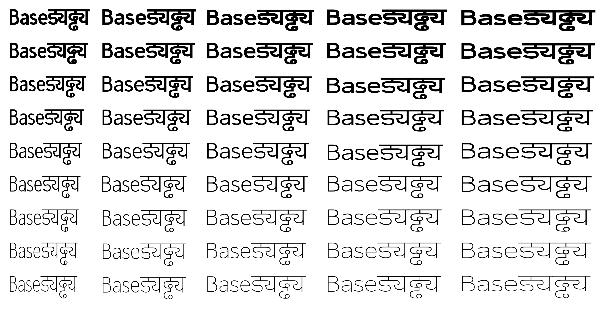

# Creating a four-master* design space

*four cps master but only one base.ufo!

For each instance I want to export I set the proportions. For example, this is `normalbols.cps`:
	
	@dictionary {
	    * {
	        baseMaster1: S"master#thinwide";
	        baseMaster2: S"master#thincompressed";        
	        baseMaster3: S"master#blackwide";        
	        baseMaster4: S"master#blackcompressed";
	        proportion1: 75/100*28;
	        proportion2: 25/100*28;
	        proportion3: 75/100*72;
	        proportion4: 25/100*72;        
	    }
	}

A quite extensive `project.yaml` file and and a shell script to export all 45 instances at once:

	#!/bin/sh
	metapolator export compressedthin compressedthin.ufo;
	metapolator export compressedextraligth compressedextraligth.ufo; 
	metapolator export compressedlight compressedlight.ufo;
	metapolator export compressedregular compressedregular.ufo;
	metapolator export compressedmedium compressedmedium.ufo;
	metapolator export compressedsemibold compressedsemibold.ufo;
	metapolator export compressedbold compressedbold.ufo;
	metapolator export compressedextrabold compressedextrabold.ufo;
	metapolator export compressedblack compressedblack.ufo;
	
	metapolator export condensedthin condensedthin.ufo;
	metapolator export condensedextralight condensedextralight.ufo;
	metapolator export condensedlight condensedlight.ufo;
	metapolator export condensedregular condensedregular.ufo;
	metapolator export condensedmedium condensedmedium.ufo;
	metapolator export condensedsemibold condensedsemibold.ufo;
	metapolator export condensedbold condensedbold.ufo;
	metapolator export condensedextrabold condensedextrabold.ufo;
	metapolator export condensedblack condensedblack.ufo;
	
	metapolator export narrowthin narrowthin.ufo;
	metapolator export narrowextralight narrowextralight.ufo;
	metapolator export narrowlight narrowlight.ufo;
	metapolator export narrowregular narrowregular.ufo;
	metapolator export narrowmedium narrowmedium.ufo;
	metapolator export narrowsemibold narrowsemibold.ufo;
	metapolator export narrowbold narrowbold.ufo;
	metapolator export narrowextrabold narrowextrabold.ufo;
	metapolator export narrowblack narrowblack.ufo;
	
	metapolator export normalthin normalthin.ufo;
	metapolator export normalextralight normalextralight.ufo;
	metapolator export normallight normallight.ufo;
	metapolator export normalregular normalregular.ufo;
	metapolator export normalmedium normalmedium.ufo;
	metapolator export normalsemibold normalsemibold.ufo;
	metapolator export normalbold normalbold.ufo;
	metapolator export normalextrabold normalextrabold.ufo;
	metapolator export normalblack normalblack.ufo;
	
	metapolator export widethin widethin.ufo;
	metapolator export wideextralight wideextralight.ufo;
	metapolator export widelight widelight.ufo;
	metapolator export wideregular wideregular.ufo;
	metapolator export widemedium widemedium.ufo;
	metapolator export widesemibold widesemibold.ufo;
	metapolator export widebold widebold.ufo;
	metapolator export wideextrabold wideextrabold.ufo;
	metapolator export wideblack wideblack.ufo;

This gives me a good starting point and I get a feeling where my masters are set. If I change any glyph or add new glyphs in the base.ufo, the entire design space gets updated. Now I want to increase the weight on the *Black*. To do this I need to [increase contrast](settingcontrast.md) on some letters.  